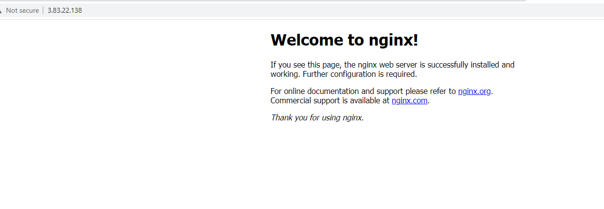
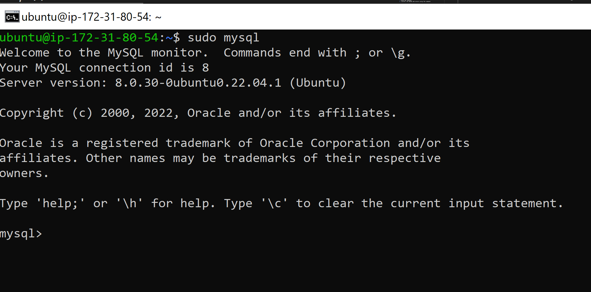
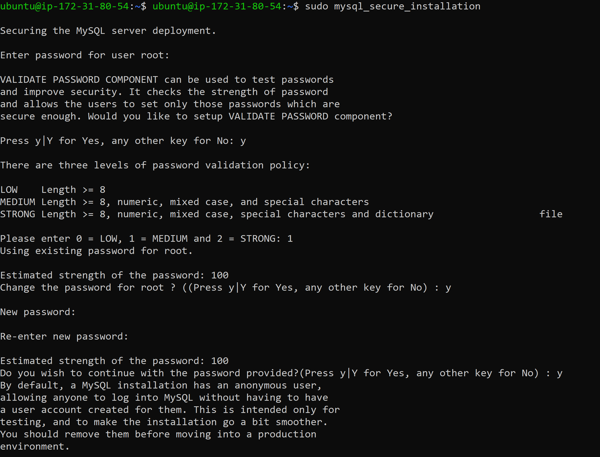
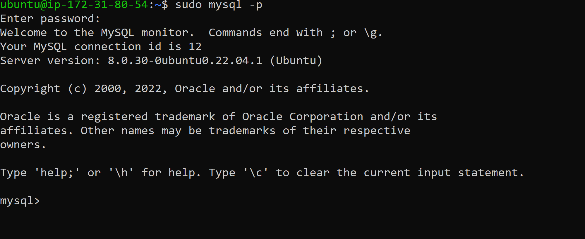
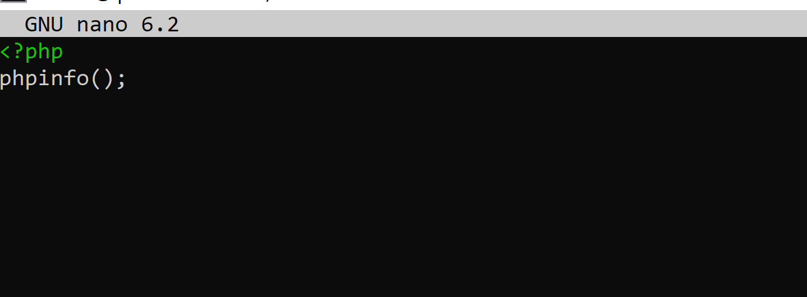
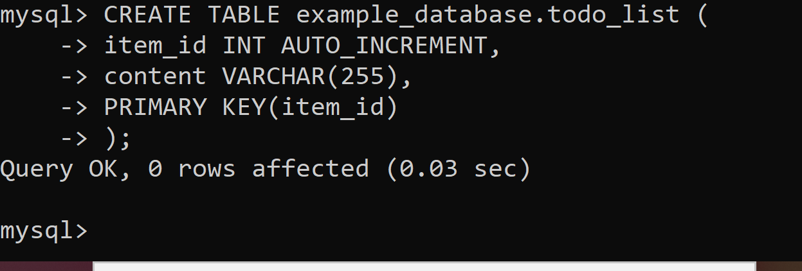

# Project 2
## Step 1 - Installtion of NGINX Web Server
1. The ubuntu server's packages index is first updated using the command 
- *sudo apt update*
2. Install the NGINX web server using the command 

- *sudo apt install nginx*

3. Check the status of the install NGINX web server 

- *sudo systemctl status nginx*

4. Verify the install NGINX web server from the shell terminal using the command
- *curl http://localhost:80*
  or
  *curl http://127.0.0.1:80* 

5. Verify the install NGINX web server from the browser using the public id address of the server

- *http://3.83.22.138:80*

## Step-2: Installing MYSQL

1. Install mysql using the apt command

- *sudo apt install mysql-server*

2.  Log into the installed mysql console
- *sudo mysql*

3. Secure the mysql database by changing the default security settings

4. Start the interactive script by running 

- *sudo mysql_secure_installation*

5. Test the newly configured password required Mysql Console
 - *sudo mysql -p*
    
    

## Step 3 - Installing PHP

1. Install the two packages *php-fpm* (PHP fastCGI process manager) and *php-mysql*  which allows PHP to communicate with Mysql-based database.

- *sudo apt install php-fpm php-mysql*

## Step 4 - Configuring NGINX to use PHP processor.
1. Create a more server block to host more website.
- *sudo mkdir /var/www/projectLEMP*

2. Assign ownership to the new directory with $USER environment variable 
- *sudo chown -R $USER:$USER /var/www/projectLEMP*

3. The new configuration file in NGINX's *site-available* directory is created
- *sudo nano /etc/nginx/sites-available/projectLEMP*

4. Activate the configuration by linking it to the Nginx's sites-enabled directory

- *sudo ln -s /etc/nginx/sites-available/projectLEMP /etc/nginx/sites-enabled/*

5. Test the configuation for synthax error

- *sudo nginx -t*

6. Disable the default NGINX 

- *sudo unlink /etc/nginx/sites-enabled/default*

7. Reload the NGINX server

- *sudo systemctl reload nginx*

8. Create an index.html file inside the new directory *projectLEmp*

- *sudo echo 'Hello LEMP from hostname' $(curl -s http://169.254.169.254/latest/meta-data/public-hostname) 'with public IP' $(curl -s http://169.254.169.254/latest/meta-data/public-ipv4) > /var/www/projectLEMP/index.html*

9. Verify the new website through the browser

 

## Step- 5: Testing PHP with NGINX

1. Test to validate that NGINX can correctly hand .php files off to the PHP processor.
- *sudo nano /var/www/projectLEMP/info.php*

2. Verify the PHP website with the content in file *info.php* from the browser

- *http://`server_domain_or_IP`/info.php*

3. Remove then info.php file because it contains relevant information.

- *sudo rm /var/www/your_domain/info.php*

## Step-6 : Retrieving Data from MYSQL Database with PHP

1. Connect to mysql database with root account
- *sudo mysql -p*

2. Create a new database in the mysql console
- *CREATE DATABASE `example_database`;*
 [Create a new database](./images/new-database.PNG)

3. Create a new user with full priviledge to the database.
- *mysql>  CREATE USER 'example_user'@'%' IDENTIFIED WITH mysql_native_password BY 'password';*

4. Give permission to the new user to access the database
-mysql> GRANT ALL ON example_database.* TO 'example_user'@'%';

5. Verify new user permission
- *mysql -u example_user -p*

6. Show Database
- mysql> SHOW DATABASES;

7. Create the test table for the Todo_list
 
 

 8. Add some content to the Database

 - 

 9. Create a new PHP file in your custom web root directory to connect to Mysql and query the content.

10. Verify the new customize website using the public ip address from the browser.
 

 

